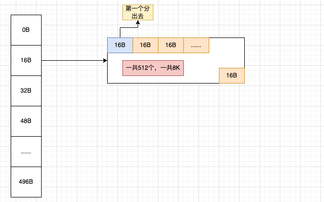
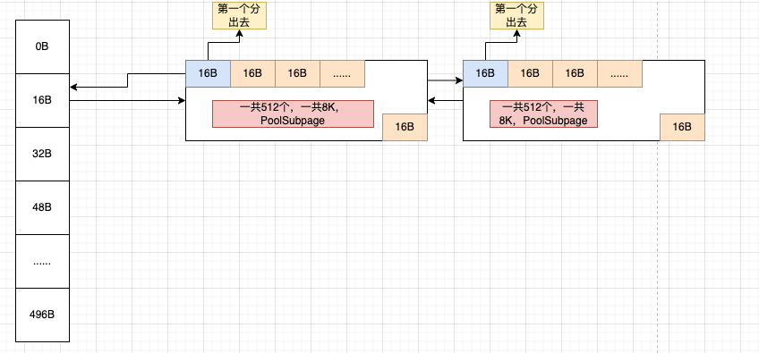
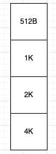

# 一、内存池

在系统开发中，内存池的作用就在于合理的使用内存资源，内存占用的更少(空间)，应用速度更快(时间)。

而在java语言中，因为还存在一个gc的问题，会带来stw的开销。于是我们使用内存池还能规避这种问题。

## 1、netty中的内存利用技巧

1、能使用基本类型，就不用包装类型。

java没有值类型，万物皆对象。傻逼一样的设计，包装类型有头，我就存一个int = 1 占4字节，各种头的开销最后能干到32字节。这种性价比简直为0。

2、如果可以的话，尽量定义类变量(static)，而不要使用成员变量。但是也不是乱用。合适的时候才是类变量。

这样可以不会让变量跟着对象走，全局一份肯定是节省开销的。但是你也要看看你能不能全局一份。

3、对象的复用，就是尽量少创建对象，能复用就复用。跟spring差不多，单例模式。spring用的是容器存储，单例获取。而netty自然也是要有这么一个容器的，netty叫做对象池，netty这个对象池是轻量级别的。当然了spring也号称轻量级，但是到了2024年10月这个时候，spring还有脸说自己轻量级吗。netty是会把对象放在fastthreadlocal（太长了，下面写ftl）中，和线程绑定，线程的生命周期内是可以复用的。io.netty.util.Recycler + ftl。各种其他的框架其实也会设计这种，比如kafka就有自己的内存池。也是非常精巧的。

4、对内存的预估，他会预估内存，大了就会调小，小了就会调大。比如Unsafe.read中在读取数据就会对ByteBuf做扩容和缩容操作。

5、zero copy 合理的使用零拷贝技术，对于file和bytebuf的设计。

6、使用堆外内存，降低gc次数，减少拷贝次数，提高传输性能https://www.cnblogs.com/Chary/p/18006508。

7、netty使用了**内存池。**

内存池一般配合堆外内存使用，可以减少拷贝等等开销，但是申请空间和回收的时候是不如直接操作堆的，而且可能有内存泄露问题，因为无法被gc管理，你用的不好就容易泄露。所以要做池化，这种就很好了。

## 2、如何设计一个内存池

设计一个内存池你要考虑什么。

1、如何高效的分配以及回收内存。

2、线程内如何复用分配的内存，线程之间如何共享内存。会不会有并发问题等等。

3、内存碎片问题，如何规避内部碎片和外部碎片。不然可能会泄露，最后导致溢出。netty是借用了jemalloc内存分配器的实现来优化这几个问题。其实netty的内存池就是java版本的jemalloc。

常见的内存分配器有glibc，tcmalloc,jemalloc等等。

~~~markdown
glibc:标准实现，兼容性非常好，各种操作系统都可以使用，缺点就是开销大，多线程之间无法共享。
tcmalloc:t代表thread c代表cache缓存 谷歌开源的，也就是说他可以有线程的缓存，还可以完成线程之间的共享。
jemalloc:tcmalloc发展而来的优秀实现，把内存做了更加细的划分，small  large huge，更加精细的划分带来的是更少的碎片。
	其中redis就使用的这个内存分配器，netty的内存池也是这玩意，只不过他用java自己实现了一版。线程内部复用内存，线程之间共享内存，而且划分了更精细的区域。
	他的核心是buddy(伙伴算法) + slab算法，其中伙伴算法解决外部碎片，slab算法解决内部碎片。其中netty基本也实现了这种。但是他有区别，os中的内存页面是4K，而netty实现为8K。并且netty的区域划分的更加精细。tiny small normal huge。可见很牛逼。
~~~

4、我们会池化什么东西？

我们池化的一定是比较昂贵的资源，比如线程池，和操作系统相关的资源，数据库连接，网络连接等等。

# 二、netty中的内存池

## 1、四种划分规格

首先我们要知道netty的内存池其实就是java版本的jemalloc。他为了更多的减少内存的碎片，提高内存的利用率。他对于内存规格进行了很细致的划分。

他主要划分了四种类型的内存规格。

~~~markdown
首先，当netty像os堆外(netty一般内存池都是堆外的)或者堆内申请内存的时候默认大小是16MB.在netty中把16MB大小称之为一个Chunk,在netty中一个Chunk被封装为一个PoolChunk类型的对象。每次申请都是16MB.这个空间对于发送数据来说其实挺大的了。那么我们如果发个几KB就申请16MB那岂不是每次利用到的就很小了。这种性价比极低的表现对于内存利用就是碎片。这种是很低效的。所以netty继续划分这个Chunk,他把每个Chunk划分为多个页，每个页的大小为8K。这个页和linux的页不一样哈。操作系统的每个页面大小是4K(不开启huge page)。于是这样内存单位就被进一步被划分了。此时最小的单位就是页，大小为8k.而且netty中的page是逻辑划分。他没有对应的实体类来封装，就是个概念。ByteBufAllocator.DEFAULT.buffer(int size);申请的内存单位是KB.

# Small/Tiny:这种规格下，Small和Tiny指的都是小于Page(8K)的。在netty中封装为SubPage(PoolSubPage)。并没有个固定值。但是还是有划分。
  # 对于Tiny来说，最小值是16B最大值是496B。 是个范围。这种规格下，每一次的增长都是16B,一直涨到496B。
  # 而Small则是几个固定值，分别是512B. 1K. 2K. 4K 。这种规格下，就四个值，每次增长就是成倍的，1 2 4这样。

# Normal：这种规格下，最小的占用申请就是一个Page(8K),而最大就是16M.所以当你申请的空间是一个Page(8K)到一个Chunk(16MB)之间，他都认为是Normal。当你申请的在这个范围内，他会按照8K的倍数来申请，比如你申请一个15MB的空间，他会给你按照8K的倍数来增长，找到一个合适的。自然就是8K 16K 32K 64K一直到16M，然后分配你这个15MB的空间。 当然你要是申请15K，那他会给你分配一个16K的，两个Page。

# Huge：netty把大于16M的内存申请定义为huge，对于这种内存申请，netty是不做池化，不做缓存的也就是内存池没这玩意。他分配的方式是Unpool分配内存。这种大规格的他认为没必要缓存，不然每次这么大，他不精细，碎片会很多。

在我们基于这个内存划分之后，我们来看他怎么申请呢。
1、比如我申请一个16B的数据，此时netty知道，你这个大小时tiny的，而且他的分配单位是Page,每次申请16M，然后划分多个逻辑page。此时他会按照tiny来给你分配。他会取出一个page(8K)。按照你的16B，把8K划分为 8 * 1024 / 16 = 512份。然后把其中一个16K给这个数据使用。然后我又申请了一个16k,那后面就从这512份里面没使用的获取分配。

2、那假如我申请的是17B的呢，此时netty依然知道你是个tiny的，他会按照16B的步长增长，16B 32B此时就能分配了，继续取出一个page，然后给你把一个page划分为8 * 1024 / 16 = 256份，然后给你分配一份。

3、那我申请的是5K的呢，你可以发现此时已经不属于Small/Tiny，他属于Normal，直接分配你一个page。

4、那我申请的是18K的呢，此时属于Normal，他会按照8K的倍数来增长，8K 16K 24K 好了，给你三个page。

5、那我申请的是3K的呢，此时属于small，他会给你一个页面按照4K划分2份，给你一份。后面的4k，留给下次small分配。

他这种各种尺度的划分，就是slab算法的体现，目的其实是尽可能的减少内部碎片。
~~~

## 2、内存池主要的类结构

~~~markdown
# Netty内存池结构的设计以及相关对象

# 1、PoolArena :netty内存池的内存管理核心，总体的管理者。
	Netty使用固定数量的多个Arena对象来进行内存的管理分配，他的数量是固定的(和你的cpu核数相关)，每一个线程都有一个PoolArena，但是多个线程之间又可以共享一个PoolArena，所以不会很多，因为能共享。

# 2、结构变量
	我们知道在netty中他把内存划分为四种规格来分配，分别是tiny small normal huge。其中huge是不会被池化缓存的，所以PoolArena不会管理huge。所以我们不说huge。而在netty中是如何管理其他三种呢。
	对于tiny，他有一个变量，tinySubPagePools,这个变量的类型是一个PoolSubPage的数组，private PoolSubPage[] tinySubPagePools
	对于small，他有一个变量，smallSubPagePools,这个变量的类型是一个PoolSubPage的数组，private PoolSubPage[] smallSubPagePools
	对于Chunk，他不是这么管理的，为了更加合理的使用内存，他使用了六个PoolChunkList集合，每个集合都是Chunk的集合。
	类似于private ArrayList<Chunk> PoolChunkList1  private ArrayList<Chunk> PoolChunkList2 ... private ArrayList<Chunk> PoolChunkList6
	之所以有六个是存在一个使用率的问题。
~~~

我们完全可以验证一下。我们来看PoolArena的源码。

~~~java
abstract class PoolArena<T> implements PoolArenaMetric {

  	// 自己定义了枚举，可以看到他不管理huge的 
    enum SizeClass {
        Tiny,
        Small,
        Normal
    }

    // ......
  
    // 这就是我们说的那几个集合
    private final PoolSubpage<T>[] tinySubpagePools;  // 默认长度32
    private final PoolSubpage<T>[] smallSubpagePools; // 默认长度4

    private final PoolChunkList<T> q050;
    private final PoolChunkList<T> q025;
    private final PoolChunkList<T> q000;
    private final PoolChunkList<T> qInit;
    private final PoolChunkList<T> q075;
    private final PoolChunkList<T> q100;
  
    // ......

    // Number of thread caches backed by this arena. 前面我们说多个线程可以共享一个PoolArena，这个变量就是记录当前这个PoolArena被几个线程共用了
    final AtomicInteger numThreadCaches = new AtomicInteger();
}
~~~

## 3、内部结构

### 3.1、Tiny

最小值是16B最大值是496B。 是个范围。这种规格下，每一次的增长都是16B,一直涨到496B。

我们看到了在PoolArena内部对于tiny的管理是使用PoolSubpage<T>[] tinySubpagePools这个32个长度的数组来管理的。那么问题来了，我们上面说过我们在分配tiny的时候，当我们申请一个16B的数据，此时netty知道，你这个大小时tiny的，而且他的分配单位是Page,每次申请16M，然后划分多个逻辑page。此时他会按照tiny来给你分配。他会取出一个page(8K)。按照你的16B，把8K划分为 8 * 1024 / 16 = 512份。然后把其中一个16K给这个数据使用。然后我又申请了一个16k,那后面就从这512份里面没使用的获取分配。

你看看这个上来就是要划分512份的，你一个32长度的数组咋存储512个内容。所以这个数组存储的不是32的内存单元。而你在看一下，**最小值是16B最大值是496B。 是个范围。这种规格下，每一次的增长都是16B,一直涨到496B。**这是tiny的增长，每次从16开始，每次步长16，在gpt的帮助下，我们列出这个等差数列。那就是 

16, 32, 48, 64, 80, 96, 112, 128, 144, 160,

176, 192, 208, 224, 240, 256, 272, 288, 304, 320, 

336, 352, 368, 384, 400, 416, 432, 448, 464, 480, 

496

我们看到一共是31个规格(其实你用496/16也一样)，其实这个长度为32的数组，存储的就是这31个规格。那么多出来那个存啥呢，存储默认的0起始值。一共是32个。凑整2的n次方，用来后面位运算做取模。

于是我们来揭开这个数组真正的结构。首先他是一个32长度的数组。

此时当我们申请一个16B长度的数据的时候，此时netty判断为一个tiny，于是会在tinySubpagePools数组中进行下标查找，发现位于16这个格子(index=1)。此时会在后面分配一个page，也就是8K,然后把这个page划分为一个个16b的单元。变为如下图：

然后后面再分配就是后续的每个16B,直到这个page用完，如果还需要，那就继续在后面挂链表(双向链表)，如图。这样就把这个规格划分缓存在了这个数组里面。

然后假如我们在分配一个47k的数据，此时发现他的位置应该在index=3的地方，也就是数组的第四个格子48B。那他会从chunk里面拿一个PoolSubpage，按照48b的大小划分256个大小，挂在48b后面，原理都一样。

那么问题就来了，我划分出来了一个个小格子，我咋知道哪块能用，哪块不能用呢。他使用了位图来实现这个功能，真的非常精巧。

### 3.2、small

当你知道了tiny的时候，small也就完全清晰了，为啥smallSubpagePools长度是4呢，因为small的划分就4个规格，他和tiny的存储结构和原理一毛一样。

一样的，只不过这个正好是4个，不用填充0，就是2的n次方，可以直接用来做位运算取模。

