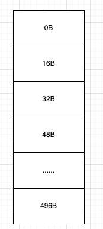

# 一、内存池

在系统开发中，内存池的作用就在于合理的使用内存资源，内存占用的更少(空间)，应用速度更快(时间)。

而在java语言中，因为还存在一个gc的问题，会带来stw的开销。于是我们使用内存池还能规避这种问题。

比较著名的内存池是内核中实现的[jemalloc][https://github.com/jemalloc/jemalloc].他的代码其实也还好，后面我们看看，我的c属于起步阶段，不太敢献丑。

## 1、netty中的内存利用技巧

1、能使用基本类型，就不用包装类型。

java没有值类型，万物皆对象。傻逼一样的设计，包装类型有头，我就存一个int = 1 占4字节，各种头的开销最后能干到32字节。这种性价比简直为0。

2、如果可以的话，尽量定义类变量(static)，而不要使用成员变量。但是也不是乱用。合适的时候才是类变量。

这样可以不会让变量跟着对象走，全局一份肯定是节省开销的。但是你也要看看你能不能全局一份。

3、对象的复用，就是尽量少创建对象，能复用就复用。跟spring差不多，单例模式。spring用的是容器存储，单例获取。而netty自然也是要有这么一个容器的，netty叫做对象池，netty这个对象池是轻量级别的。当然了spring也号称轻量级，但是到了2024年10月这个时候，spring还有脸说自己轻量级吗。netty是会把对象放在fastthreadlocal（太长了，下面写ftl）中，和线程绑定，线程的生命周期内是可以复用的。io.netty.util.Recycler + ftl。各种其他的框架其实也会设计这种，比如kafka就有自己的内存池。也是非常精巧的。

4、对内存的预估，他会预估内存，大了就会调小，小了就会调大。比如Unsafe.read中在读取数据就会对ByteBuf做扩容和缩容操作。

5、zero copy 合理的使用零拷贝技术，对于file和bytebuf的设计。

6、使用堆外内存，降低gc次数，减少拷贝次数，提高传输性能https://www.cnblogs.com/Chary/p/18006508。

7、netty使用了**内存池。**

内存池一般配合堆外内存使用，可以减少拷贝等等开销，但是申请空间和回收的时候是不如直接操作堆的，而且可能有内存泄露问题，因为无法被gc管理，你用的不好就容易泄露。所以要做池化，这种就很好了。

## 2、如何设计一个内存池

设计一个内存池你要考虑什么。

1、如何高效的分配以及回收内存。

2、线程内如何复用分配的内存，线程之间如何共享内存。会不会有并发问题等等。

3、内存碎片问题，如何规避内部碎片和外部碎片。不然可能会泄露，最后导致溢出。netty是借用了jemalloc内存分配器的实现来优化这几个问题。其实netty的内存池就是java版本的jemalloc。

常见的内存分配器有glibc，tcmalloc,jemalloc等等。

~~~markdown
glibc:标准实现，兼容性非常好，各种操作系统都可以使用，缺点就是开销大，多线程之间无法共享。
tcmalloc:t代表thread c代表cache缓存 谷歌开源的，也就是说他可以有线程的缓存，还可以完成线程之间的共享。
jemalloc:tcmalloc发展而来的优秀实现，把内存做了更加细的划分，small  large huge，更加精细的划分带来的是更少的碎片。
	其中redis就使用的这个内存分配器，netty的内存池也是这玩意，只不过他用java自己实现了一版。线程内部复用内存，线程之间共享内存，而且划分了更精细的区域。
	他的核心是buddy(伙伴算法) + slab算法，其中伙伴算法解决外部碎片，slab算法解决内部碎片。其中netty基本也实现了这种。但是他有区别，os中的内存页面是4K，而netty实现为8K。并且netty的区域划分的更加精细。tiny small normal huge。可见很牛逼。
~~~

4、我们会池化什么东西？

我们池化的一定是比较昂贵的资源，比如线程池，和操作系统相关的资源，数据库连接，网络连接等等。

# 二、netty中的内存池

## 1、四种划分规格

首先我们要知道netty的内存池其实就是java版本的jemalloc。他为了更多的减少内存的碎片，提高内存的利用率。他对于内存规格进行了很细致的划分。

他主要划分了四种类型的内存规格。

~~~markdown
首先，当netty像os堆外(netty一般内存池都是堆外的)或者堆内申请内存的时候默认大小是16MB.在netty中把16MB大小称之为一个Chunk,在netty中一个Chunk被封装为一个PoolChunk类型的对象。每次申请都是16MB.这个空间对于发送数据来说其实挺大的了。那么我们如果发个几KB就申请16MB那岂不是每次利用到的就很小了。这种性价比极低的表现对于内存利用就是碎片。这种是很低效的。所以netty继续划分这个Chunk,他把每个Chunk划分为多个页，每个页的大小为8K。这个页和linux的页不一样哈。操作系统的每个页面大小是4K(不开启huge page)。于是这样内存单位就被进一步被划分了。此时最小的单位就是页，大小为8k.而且netty中的page是逻辑划分。他没有对应的实体类来封装，就是个概念。ByteBufAllocator.DEFAULT.buffer(int size);申请的内存单位是KB.

# Small/Tiny:这种规格下，Small和Tiny指的都是小于Page(8K)的。在netty中封装为SubPage(PoolSubPage)。并没有个固定值。但是还是有划分。
  # 对于Tiny来说，最小值是16B最大值是496B。 是个范围。这种规格下，每一次的增长都是16B,一直涨到496B。
  # 而Small则是几个固定值，分别是512B. 1K. 2K. 4K 。这种规格下，就四个值，每次增长就是成倍的，1 2 4这样。

# Normal：这种规格下，最小的占用申请就是一个Page(8K),而最大就是16M.所以当你申请的空间是一个Page(8K)到一个Chunk(16MB)之间，他都认为是Normal。当你申请的在这个范围内，他会按照8K的倍数来申请，比如你申请一个15MB的空间，他会给你按照8K的倍数来增长，找到一个合适的。自然就是8K 16K 32K 64K一直到16M，然后分配你这个15MB的空间。 当然你要是申请15K，那他会给你分配一个16K的，两个Page。

# Huge：netty把大于16M的内存申请定义为huge，对于这种内存申请，netty是不做池化，不做缓存的也就是内存池没这玩意。他分配的方式是Unpool分配内存。这种大规格的他认为没必要缓存，不然每次这么大，他不精细，碎片会很多。

在我们基于这个内存划分之后，我们来看他怎么申请呢。
1、比如我申请一个16B的数据，此时netty知道，你这个大小时tiny的，而且他的分配单位是Page,每次申请16M，然后划分多个逻辑page。此时他会按照tiny来给你分配。他会取出一个page(8K)。按照你的16B，把8K划分为 8 * 1024 / 16 = 512份。然后把其中一个16K给这个数据使用。然后我又申请了一个16k,那后面就从这512份里面没使用的获取分配。

2、那假如我申请的是17B的呢，此时netty依然知道你是个tiny的，他会按照16B的步长增长，16B 32B此时就能分配了，继续取出一个page，然后给你把一个page划分为8 * 1024 / 16 = 256份，然后给你分配一份。

3、那我申请的是5K的呢，你可以发现此时已经不属于Small/Tiny，他属于Normal，直接分配你一个page。

4、那我申请的是18K的呢，此时属于Normal，他会按照8K的倍数来增长，8K 16K 24K 好了，给你三个page。

5、那我申请的是3K的呢，此时属于small，他会给你一个页面按照4K划分2份，给你一份。后面的4k，留给下次small分配。

他这种各种尺度的划分，就是slab算法的体现，目的其实是尽可能的减少内部碎片。
~~~

## 2、内存池主要的类结构

~~~markdown
# Netty内存池结构的设计以及相关对象

# 1、PoolArena :netty内存池的内存管理核心，总体的管理者。
	Netty使用固定数量的多个Arena对象来进行内存的管理分配，他的数量是固定的(和你的cpu核数相关)，每一个线程都有一个PoolArena，但是多个线程之间又可以共享一个PoolArena，所以不会很多，因为能共享。默认是cpu * 2。

# 2、结构变量
	我们知道在netty中他把内存划分为四种规格来分配，分别是tiny small normal huge。其中huge是不会被池化缓存的，所以PoolArena不会管理huge。所以我们不说huge。而在netty中是如何管理其他三种呢。
	对于tiny，他有一个变量，tinySubPagePools,这个变量的类型是一个PoolSubPage的数组，private PoolSubPage[] tinySubPagePools
	对于small，他有一个变量，smallSubPagePools,这个变量的类型是一个PoolSubPage的数组，private PoolSubPage[] smallSubPagePools
	对于Chunk，他不是这么管理的，为了更加合理的使用内存，他使用了六个PoolChunkList集合，每个集合都是Chunk的集合。
	类似于private ArrayList<Chunk> PoolChunkList1  private ArrayList<Chunk> PoolChunkList2 ... private ArrayList<Chunk> PoolChunkList6
	之所以有六个是存在一个使用率的问题，涉及到冷热划分的概念了。
~~~

我们完全可以验证一下。我们来看PoolArena的源码。

~~~java
abstract class PoolArena<T> implements PoolArenaMetric {

  	// 自己定义了枚举，可以看到他不管理huge的 
    enum SizeClass {
        Tiny,
        Small,
        Normal
    }

    // ......
  
    // 这就是我们说的那几个集合
    private final PoolSubpage<T>[] tinySubpagePools;  // 默认长度32
    private final PoolSubpage<T>[] smallSubpagePools; // 默认长度4

    private final PoolChunkList<T> q050;
    private final PoolChunkList<T> q025;
    private final PoolChunkList<T> q000;
    private final PoolChunkList<T> qInit;
    private final PoolChunkList<T> q075;
    private final PoolChunkList<T> q100;
  
    // ......

    // Number of thread caches backed by this arena. 
    // 前面我们说多个线程可以共享一个PoolArena，这个变量就是记录当前这个PoolArena被几个线程共用了
    final AtomicInteger numThreadCaches = new AtomicInteger();
}
~~~

## 3、内部结构

### 3.1、Tiny

最小值是16B最大值是496B。 是个范围。这种规格下，每一次的增长都是16B,一直涨到496B。

我们看到了在PoolArena内部对于tiny的管理是使用PoolSubpage<T>[] tinySubpagePools这个32个长度的数组来管理的。那么问题来了，我们上面说过我们在分配tiny的时候，当我们申请一个16B的数据，此时netty知道，你这个大小时tiny的，而且他的分配单位是Page,每次申请16M，然后划分多个逻辑page。此时他会按照tiny来给你分配。他会取出一个page(8K)。按照你的16B，把8K划分为 8 * 1024 / 16 = 512份。然后把其中一个16K给这个数据使用。然后我又申请了一个16k,那后面就从这512份里面没使用的获取分配。

你看看这个上来就是要划分512份的，你一个32长度的数组咋存储512个内容。所以这个数组存储的不是32的内存单元。而你在看一下，**最小值是16B最大值是496B。 是个范围。这种规格下，每一次的增长都是16B,一直涨到496B。**这是tiny的增长，每次从16开始，每次步长16，在gpt的帮助下，我们列出这个等差数列。那就是 

16, 32, 48, 64, 80, 96, 112, 128, 144, 160,

176, 192, 208, 224, 240, 256, 272, 288, 304, 320, 

336, 352, 368, 384, 400, 416, 432, 448, 464, 480, 

496

我们看到一共是31个规格(其实你用496/16也一样)，其实这个长度为32的数组，存储的就是这31个规格。那么多出来那个存啥呢，存储默认的0起始值。一共是32个。凑整2的n次方，用来后面位运算做取模。

于是我们来揭开这个数组真正的结构。首先他是一个32长度的数组。

此时当我们申请一个16B长度的数据的时候，此时netty判断为一个tiny，于是会在tinySubpagePools数组中进行下标查找，发现位于16这个格子(index=1)。此时会在后面分配一个page，也就是8K,然后把这个page划分为一个个16b的单元。变为如下图：

然后后面再分配就是后续的每个16B,直到这个page用完，如果还需要，那就继续在后面挂链表(双向链表)，如图。这样就把这个规格划分缓存在了这个数组里面。

然后假如我们在分配一个47k的数据，此时发现他的位置应该在index=3的地方，也就是数组的第四个格子48B。那他会从chunk里面拿一个PoolSubpage，按照48b的大小划分256个大小，挂在48b后面，原理都一样。

那么问题就来了，我划分出来了一个个小格子，我咋知道哪块能用，哪块不能用呢。他使用了位图来实现这个功能，真的非常精巧。

### 3.2、small

当你知道了tiny的时候，small也就完全清晰了，为啥smallSubpagePools长度是4呢，因为small的划分就4个规格，他和tiny的存储结构和原理一毛一样。

一样的，只不过这个正好是4个，不用填充0，就是2的n次方，可以直接用来做位运算取模。

所以你其实能看出来，虽然我们说page是一个逻辑上的概念，实际上不存在page的实体。但是他的划分的单元就是page，每次都是拿出来一个或者多个page进行分配。小于一个page的就是tiny/small。大于一个page的就是normal，大于16M的就是huge。但是实际上每次划出来的这个page用来分配都是从16M的这个chunck里面分配出来的，而chunck是实打实的有对应的类的。他不会直接找到chunck，他分配是基于page来分配的。但是如果你是tiny或者small的时候，一次给你8K你也用不了，内部碎片还是很大，所以就会按照你的尺寸把一个page再均分好多份，给你一份或者多份，其余的就挂在链表上后面再分配。

如果你不够了，那就再从一个chunck取一个8k，然后封装为一个PoolSubPage，然后再按照那个方式划分。

### 3.3、验证

我们分析了这么多，怎么在代码中验证一下看看是不是这样分配的呢。上面我们说了，每一个Arena都是和线程绑定的。所以我们要看这个结构，我们只需要获取我们当前的线程然后看他内部的threadlocalmap就可以了。而且我们要知道他们内部是缓存在fastthreadlocal里面的，至于ftl是怎么整合j d k原生tl的我们先不说。你只需要知道，ftl是存在tl的internalThreadLocal里面的一个entry里面的就可以了，于是我们来看代码。

~~~java
public class TestPool {
    public static void main(String[] args) {
        // 申请10B
        ByteBufAllocator.DEFAULT.buffer(10);

        Thread thread = Thread.currentThread();
        System.out.println(thread.getName());
    }
}
~~~

上面我们申请了10B大小的空间，首先他是一个tiny(16B-496B)。但是他又不足16b，所以一定会被向上取整为16B,然后去tiny数组的第二个格子，也就是index=1的位置去找，第一次肯定是没有的，于是netty肯定会给你申请一个chunk(16M)，从这个chunk中分出一个page大小，包装成PoolSubPage，并且以16B的尺寸切割，为512份，并且分配其中的一份。并且挂在index = 1这个格子后面，成为双向链表的第一个元素。那么此时问题来了，你说是就是啊。那么我们不妨把断点打在上面看看thread的结构就好了。

我们来看这个thread的结构。

### 3.4、PoolSubpage

看着这个图现在我们来思考一个问题，我们分配了一个page之后，比如我们分走了一个小块一份16B，我们把它叫做16b1,那么下次又有人来要空间，这个16b1你肯定不能分给她了吧，毕竟人家已经被使用着了。你再分走怕不是数据就脏了。那么问题来了，怎么知道哪个块被分走了，哪个没有呢。于是引出了下一个结构，位图bitmap。所以我们就要在PoolSubpage这个结构中划分一个位图，来标识PoolSubpage中的小块到底哪个用了哪个没用。

位图结构其实也简单，就是一个数组，每一位表达一个语义。1表示已经分配走了，0表示还没分配。那么是不是我们划分了512个小块，这个数组就是512个长度呢，每一个位表示一个小块。很自然对吧。

但是不好意思，不是，这个bitmap数组长度固定为8，而且不变。

~~~java
final class PoolSubpage<T> implements PoolSubpageMetric {

    // ******
    private final long[] bitmap;
    // ******
}
~~~

那就奇怪了，你长度为8，咋表达我这么多小块呢。所以他必然不是每一位就单独表达一个元素。但是他是一个数组，他是一个long类型的数组，我们知道long类型是占据8个字节的，也就是64位。

而这个数组长度就是8，那8个64位，不就是512吗。而我们这个page最大划分的也就是512块(按16B划分)，其余的情况都不够512。所以他是足以表达我们的需求的。他的结构是这样的。

而此时我们分配了一个小块，那其实就是第一个long的64位的第一位变成了1，其余的都还是0.

### 3.5、PoolChunkList(normal)

在搞完了tiny/small之后，我们还剩下一个normal规格的内存分配。上面我们看到了，这种规格的分配在六个数组中管理。

~~~java
private final PoolChunkList<T> q050;
private final PoolChunkList<T> q025;
private final PoolChunkList<T> q000;
private final PoolChunkList<T> qInit;
private final PoolChunkList<T> q075;
private final PoolChunkList<T> q100;
~~~

也就是六个PoolChunkList，每个PoolChunkList里面管理着一组Chunk，一开始我们说了一个Chunk是16MB。

那么为什么是6个数组呢。不能是一个Chunk，或者一个PoolChunkList呢？

#### 3.5.1、一个Chunk

那就是说只有一个16mb的内存块进行分配，你觉得这个行吗，有些场景分分钟给你突破这个数据分配。16mb算个毛线，所以pass。

#### 3.5.2、一个PoolChunkList

既然一个不够，那给多个总行了吧，我们用一个list里面放多个Chunk，这样不够了还能扩容，了不起做成链表。

比如我们有四个。是这样的。

假如在程序运行中，逐渐经过分配归还，他们现在每个chunk还剩一部分，变成了这样。

不必惊讶为啥后面的剩的会比前面的多，因为是动态的，有的可能释放了空间。

此时外部要申请一个8M的内存空间，那么就需要遍历，发现第一个不行，第二个不行，第三个不行，直到找到最后一个才发现可以了。那么问题来了，这才四个，要是四百个，四万个呢？这种效率是非常低的。而这种低效率来自于我们不知道哪个chunk是可用的，我们只能遍历去找。所以如果我们能区分开，哪些用完了，哪些还没用呢，哪些用了百分之二十了，这样我们就能很直接的找到我们在哪个里面分配。于是这种也被pass了。

#### 3.5.3、多个PoolChunkList

基于以上的逻辑，我们需要多个chunk的集合。每个集合按照使用率来划分，那我们后面就能直接去哪个集合里面分配了，这样就快多了。至于多个是几个呢。netty用了6个。

他们分别代表不同使用率的chunk的集合。

~~~java
// 以下六个代表不同使用率的chunk的集合
private final PoolChunkList<T> qInit; 0-25%
private final PoolChunkList<T> q000;  1%-50%
private final PoolChunkList<T> q025;  25%-75%
private final PoolChunkList<T> q050;  50%-100%
private final PoolChunkList<T> q075;  75%-100%
private final PoolChunkList<T> q100;  100%
~~~

可以看到他不是一个准确值，他是个范围，因为内存是不断的在变化的。你要准确就会一直变，一直计算，而且你还不一定就能计算出那个值，很难把握，没什么意义。反而还会增加负担。

而且即便你是个范围，他的这些个chunk的使用率还是会变，此时他会移动到符合他使用率的PoolChunkList。但是因为是个范围，移动的不会很频繁。

而且因为每个PoolChunkList其实是以双向链表的结构维护的，所以移动的时候只需要把chunk的指针移动到另一个符合PoolChunkList的尾部即可。

而且你可以看到这6个集合的使用率他不是严格划分区间的，他是有区间重合的，这种是为了避免移动频繁。比如一开始你chunk1使用率在26%位于q025。此时他就算涨了40变成了66%，他也不用移动到q050，还在q025中分布即可。他这种模糊了区间，让移动变少。你要是非常精确的划分，那就一旦变了，那就有可能移动了。这样在快速变化的内存分布中会非常的计算频繁，浪费性能。他不需要确切的值，差不多能分配就行。

#### 3.5.4、移动

我们上面说，当某一个PoolChunkList中的chunk的使用率变化的时候，他是会在这些PoolChunkList中移动的，进而来满足他的使用率对应的范围。这个说法对，但是不全对。他的移动是有规则的。我们来看源码。

~~~java
// 构造函数
PoolChunkList(PoolArena<T> arena, PoolChunkList<T> nextList, int minUsage, int maxUsage, int chunkSize)

// 初始化
q100 = new PoolChunkList<T>(this, null, 100, Integer.MAX_VALUE, chunkSize);
q075 = new PoolChunkList<T>(this, q100, 75, 100, chunkSize);
q050 = new PoolChunkList<T>(this, q075, 50, 100, chunkSize);
q025 = new PoolChunkList<T>(this, q050, 25, 75, chunkSize);
q000 = new PoolChunkList<T>(this, q025, 1, 50, chunkSize);
qInit = new PoolChunkList<T>(this, q000, Integer.MIN_VALUE, 25, chunkSize);

q100.prevList(q075);
q075.prevList(q050);
q050.prevList(q025);
q025.prevList(q000);
q000.prevList(null);
qInit.prevList(qInit);
~~~

我们看到在初始化这6个PoolChunkList的时候，他的nextList就表示当前PoolChunkList中的chunk能移动的下一个PoolChunkList。

而后面的prevList表达的是他能向前移动的PoolChunkList。于是根据这个代码我们可以绘制出他的移动图。

这样你能看出来，他的移动不是随便就能移动的，他有自己的移动方向，比如当前有一个chunk使用率为100，此时他位于q100。然后他释放了40的使用率，此时他的使用率变成了60。按道理说此时他应该满足了q050。但是，他不能移动去q050，因为不满足移动规则，他只能去q075，然后再由q075移动到q050。

而且你还看到100不能移动去init，而且其他的都不能移动去init,那我有一个chunk要是都归还了内存，现在就是0，你让我去哪里。对不起，此时这种chunk，直接归还os，直接原地释放。使用率为0的除了init本地出产的其余都会还给os。但是一般情况下，他不是直接干到0，他是慢慢降，往回走，直到q000的时候就归还了。我们现在说的都是堆外，所以他是归还os，如果是堆就是归还堆。

而且你也其实能看出来，每一个chunk一开始创建出来，是在qinit中被创建出来，其实你看名字也能看个差不多。

而且qinit中使用率为0的不会释放资源，为0也还能用(从25释放到0也不会释放)。但是q000中为0的是会归还的。

其次在q000中也会有百分之0的情况，1、在q000中释放没了，2、从上面退下来的为0的。这两种都会被归还。

**源码：**

关于移动，我们来看看他的源码内容来印证一些我们的猜测。

我们要看的就是io.netty.buffer.PoolChunkList这个类。

我们先来看他的构造函数：

~~~java
final class PoolChunkList<T> implements PoolChunkListMetric {
    private static final Iterator<PoolChunkMetric> EMPTY_METRICS = Collections.<PoolChunkMetric>emptyList().iterator();
  	// PoolChunkList所属的PoolArena
    private final PoolArena<T> arena;
  	// 后置PoolChunkList
    private final PoolChunkList<T> nextList;
  	// 当前PoolChunkList的最小占用空间，一旦那个chunk的占用低于了这个值，就发生移动，每个PoolChunkList的最小值不一样
  	// 比如q000：1%-50%。一个chunk大小为16M,那么他的minUsage就是1，对应的max也是一样的，都有自己的值，一旦大于最大值，也会移动
  	// 这个值是在初始化这六个PoolChunkList的时候写死的。
    private final int minUsage;
    private final int maxUsage;
  	// PoolChunkList这个双向链表的长度
    private final int maxCapacity;
  	// 双向链表的头节点
    private PoolChunk<T> head;

    // 前置PoolChunkList
    private PoolChunkList<T> prevList;

  	// 构造函数
    PoolChunkList(PoolArena<T> arena, PoolChunkList<T> nextList, int minUsage, int maxUsage, int chunkSize) {
        assert minUsage <= maxUsage;
        this.arena = arena;
        this.nextList = nextList;
        this.minUsage = minUsage;
        this.maxUsage = maxUsage;
        maxCapacity = calculateMaxCapacity(minUsage, chunkSize);
    }

		// 为当前的PoolChunkList添加他的上移PoolChunkList
    void prevList(PoolChunkList<T> prevList) {
        assert this.prevList == null;
        this.prevList = prevList;
    }
}
~~~

在看到了构造函数之后，我们来看他在arena中初始化这六个PoolChunkList的设计。因为我们主打关注移动，所以我们看一看他的前置PoolChunkList和后置PoolChunkList以及min和max即可。

~~~java
q100 = new PoolChunkList<T>(this, null, 100, Integer.MAX_VALUE, chunkSize);
q075 = new PoolChunkList<T>(this, q100, 75, 100, chunkSize);
q050 = new PoolChunkList<T>(this, q075, 50, 100, chunkSize);
q025 = new PoolChunkList<T>(this, q050, 25, 75, chunkSize);
q000 = new PoolChunkList<T>(this, q025, 1, 50, chunkSize);
qInit = new PoolChunkList<T>(this, q000, Integer.MIN_VALUE, 25, chunkSize);

q100.prevList(q075);
q075.prevList(q050);
q050.prevList(q025);
q025.prevList(q000);
q000.prevList(null);
qInit.prevList(qInit);
~~~

好了，我们只是记住，后面我们会回来看的。这里有大用。

关于移动主要发生在io.netty.buffer.PoolChunkList#free中，我们来看，

~~~java
boolean free(PoolChunk<T> chunk, long handle, ByteBuffer nioBuffer) {
  	/**
  		当前chunk的使用小于了最小值了，那就要发生移动了。我们知道chunk是位于PoolChunkList这个双向链表的。自然移动就是链表的移动。
  		自然就是leetcode上哪些关于链表移除的操作，先摘除，在添加到新的链表中。
  	*/
    if (chunk.usage() < minUsage) {
      	// 这里就是从当前链表摘除，没啥说的，一些固有实现，掰扯一下就看懂了
        remove(chunk);
        // Move the PoolChunk down the PoolChunkList linked-list.
      	// 这里是把这个chunk添加到下一个PoolChunkList中
        return move0(chunk);
    }
    return true;
}
~~~

所以我们来看move0(chunk)：

~~~java
private boolean move0(PoolChunk<T> chunk) {
  	/**
  		当前置的PoolChunkList为空，那什么时候会发生这种呢，我们前面说过了q000的前置是空的，并且他的
  		min和max分别是1, 50。
  	*/
    if (prevList == null) {
       /**
      	There is no previous PoolChunkList so return false which result in having the PoolChunk destroyed and
      	all memory associated with the PoolChunk will be released.
      	此时你已经位于q000了，并且你的占用量是0，直接返回false，当你返回false的时候，你要清楚我们这个调用点最开始是在
      	io.netty.buffer.PoolArena#freeChunk。这里看到你返回false，最后会调用io.netty.buffer.PoolArena#destroyChunk
      	这个方法会直接把这个PoolChunk销毁，不会再池化了。所以我们得到结论1:当一个PoolChunk在q000的时候，他如果没有用量，会被销毁。
       */
        assert chunk.usage() == 0;
        return false;
    }
  	// 而走到这里说明你不是q000，因为你存在前置PoolChunkList
    return prevList.move(chunk);
}
~~~

那么我们来看prevList.move(chunk);io.netty.buffer.PoolChunkList#move

~~~java
private boolean move(PoolChunk<T> chunk) {
    assert chunk.usage() < maxUsage;
		/**
    	这是个递归，如果你移动到了下一个PoolChunkList依然超出了当前PoolChunkList的范围，那就继续移动。
    	所以我们得到结论2:当你的chunk在六个PoolChunkList上移动的时候，他会沿着移动链路一直移动到最后符合条件的PoolChunkList
    */
    if (chunk.usage() < minUsage) {
        // Move the PoolChunk down the PoolChunkList linked-list.
        return move0(chunk);
    }

    // PoolChunk fits into this PoolChunkList, adding it here.
  	// 来到这里就是跳出递归了，说明符合当前PoolChunkList的范围了，那就添加进去，添加也没啥说的，就是一个节点如何进入双向链表，
  	// 什么？看不懂，求求你刷刷算法吧
    add0(chunk);
    return true;
}
~~~

但是我们上面说，我们在init中初始化出来的chunk即便是0也不会销毁，这个点我们并没有看到。那么我们咋验证一下呢，我们先来看init的初始化代码。

~~~java
qInit = new PoolChunkList<T>(this, q000, Integer.MIN_VALUE, 25, chunkSize);
qInit.prevList(qInit);
~~~

首先他的后置是q000，前置就是自己。关键点在于最小值，她是integer的最小值。当我们的chunk在移动链路上移动的时候，上面我们看到他会执行chunk.usage() < minUsage这个递归条件，然后移动出去请问你的占用量要如何小于minusage=Integer.MIN_VALUE这个最小值呢。你作为一个整数，永远不可能小于最小的整数。就像你永远不会比你儿子岁数小一样。所以他必然跳过这个if分支，他会直接执行add0(chunk);这个就是发生移动，而不是销毁。因为你走不到move0，所以不会给io.netty.buffer.PoolArena#destroyChunk返回false，自然不会被销毁。

所以这就保证了这个点。

**所以我们得到结论3:在init中初始化出来的chunk即便是0也不会销毁。**

所以最终我们得到三个结论：

~~~markdown
# 1、当一个PoolChunk在q000的时候，他如果没有用量，会被销毁。
# 2、当你的chunk在六个PoolChunkList上移动的时候，他会沿着移动链路一直移动到最后符合条件的PoolChunkList。
# 3、在init中初始化出来的chunk即便是0也不会销毁。他会被使用，即便他开始是0，后面变成12，后面又变成0，他也不会被销毁，这里是他的安全区，因为你永远不可能比int的最小值小(你懂的)。
~~~

对应的max的升级其实也是一样的。

#### 3.5.5、Chunk的创建

那么什么时候会创建Chunk呢，自然就是我们需要申请的时候。既然是申请那就找到arena中的io.netty.buffer.PoolArena#allocate(io.netty.buffer.PoolThreadCache, io.netty.buffer.PooledByteBuf<T>, int)方法

~~~java
private void allocate(PoolThreadCache cache, PooledByteBuf<T> buf, final int reqCapacity) {
    final int normCapacity = normalizeCapacity(reqCapacity);
    if (isTinyOrSmall(normCapacity)) { // capacity < pageSize
        // 直接看allocateNormal，因为只有normal才会涉及chunk，先不要抬杠，可能tiny/small不够的时候也没有page的时候也要chunk，我们刚开始看，先看这里。不要考虑太极端的case
        synchronized (this) {
            allocateNormal(buf, reqCapacity, normCapacity);
        }

    }

}
~~~

于是我们来看allocateNormal

~~~java
private void allocateNormal(PooledByteBuf<T> buf, int reqCapacity, int normCapacity) {
  	/**
  		首先我们看到，他不是立马就先创建，他会先去这六个集合里面去找，找到了就返回，不是立刻返回。
  		但是你可能会问，为啥我50都没找到，还去75找，因为这个是动态变化的，可能你50没找到，后面我75突然就有了呢，double check
  	*/
    if (q050.allocate(buf, reqCapacity, normCapacity) || q025.allocate(buf, reqCapacity, normCapacity) ||
        q000.allocate(buf, reqCapacity, normCapacity) || qInit.allocate(buf, reqCapacity, normCapacity) ||
        q075.allocate(buf, reqCapacity, normCapacity)) {
        return;
    }

    // Add a new chunk. 上面都没找到，来这里newChunk创建一个新的出来
    PoolChunk<T> c = newChunk(pageSize, maxOrder, pageShifts, chunkSize);
    boolean success = c.allocate(buf, reqCapacity, normCapacity);
    assert success;
  	// 创建之后，添加到init，正式出生。后面随着他的使用会慢慢升级可能去q100，当然中间也可能随着内存的释放会被降级，但是永远不会再回到init了
  	// 最后的归属就是q000，这个前面我们说了。三个结论可以论证这个观点。
    qInit.add(c);
}
~~~

### 3.6、PoolChunk

#### 3.6.1、结构所在

其实到了这里，我们对于这个概念已经不陌生了，因为我们已经知道。

PoolChunk有如下特性：

~~~markdown
# 1、是netty申请内存的最小单位16MB
# 2、出生在qinit集合中
# 3、被划分为2048个page，每个page是8K,当我们申请一个9k的大小的时候，他会按照8k 16k 32k 64K这样的规格去查找，所以他会给你分配一个16k的，也就是两个page
~~~

那么我们要面对的一个问题就是，她是如何对page做管理的，当我们分配内存的时候，他给我们到底分配哪个page呢？

而他管理的方式就是伙伴算法，这个算法在内核中也是有涉及的，因为就是[jemalloc](https://github.com/jemalloc/jemalloc)算法的翻版。

而他的数据结构，正是一个满二叉树(*一个二叉树,如果每一层的结点数都达到最大值,则这个二叉树就是满二叉树*。)。不信的话你去看看他这个类的注释。

io.netty.buffer.PoolChunk。我把注释粘贴下来了一部分，我们看看这个满二叉树的结构到底是啥。

~~~markdown
* depth=0        1 node (chunkSize)
* depth=1        2 nodes (chunkSize/2)
* ..
* ..
* depth=d        2^d nodes (chunkSize/2^d)
* ..
* depth=maxOrder 2^maxOrder nodes (chunkSize/2^{maxOrder} = pageSize)
* depth=maxOrder is the last level and the leafs consist of pages
~~~

你可以看到，第一层也就是根节点，其实是chunksize，其实就是16M

每往后都分二叉，然后处以2，得到下一层，最后一层的叶子结点的大小是pagesize，其实就是8K。

这个树非常的大，我就不画了，要命。但是她是满二叉树，其实是等比数列，我们可以知道，他一共是11层。而且叶子结点一共是2048个。也就是2048个8K。于是此时你就能明白，这颗树上的所有节点，其实就包括了8K-16M期间所有的2的n次方的规格。

那么他是如何管理这个树的呢，这个树又如何和内存分配管理搭边呢。首先你要明白，树是逻辑结构，内存中并不存在树这个结构。就像内存里面没有环一样，你可以用数组去模拟环。

这里底层用的是数组来实现的树。

~~~JAVA
final class PoolChunk<T> implements PoolChunkMetric {

    // 这就是那两个数组，完成的树
    private final byte[] memoryMap;
    private final byte[] depthMap;
}
~~~

那么数组怎么实现树呢，这是个值得讨论的问题，我们知道数组其实就两个因素，一个是下标，一个是该下标存储的值。那么他还是个满二叉树。那么我们就可以从左到右遍历这颗树，为每个节点编号，按照顺序把编号作为数组的下标，把节点上的值作为数组的值，存进去，那么这样就保存在了数组上。

所以16MB对应的下标就是1，两个8M分别是2，3，然后水平遍历一直给他分一个下标号。最后一层是2048到4095，这个其实不难，等比数列。一共是2048个叶子结点，因为16m就能划2048个page。他最终分配是按照叶子结点去分配的。

倒数第二层的16K那一层就是1024-2047。而数组的value存的就是他的层数(从0开始)。注意是层数，不是那个什么2Mb,3Kb啥的。没有大小的概念，他存的层数。

当我们初始化PoolChunk的时候，memoryMap和depthMap初始化一摸一样，就是那个满二叉树，编号是下标，value存层数。那么我们有了memoryMap为啥还要depthMap呢，他是作为辅助存储的，因为后面我们逐渐分配的时候memoryMap会慢慢变，那我们需要一个我输入下标直接获取层数的地方，他就是做这个的。因为初始化他存储了，下标和层高的数据，所以他depthMap[index]就能取出里面存的层高。所以其实depthMap永远不变，他就是个参考，一个字典。不如叫他dictMap得了。

但是memoryMap是会变化的，他根据我们的节点的空间分配的过程，这个memoryMap的value会发生变化。当你变化了就知道哪些可用(还没分配)哪些不可用(被分配了)。并且我们depthMap不变，很简单一对比就知道你变了没变。

#### 3.6.2、如何管理内存

我们现在知道这个满二叉树的每一个节点其实对应的都是一个内存空间。

netty定义了两个规则来处理分配：

1、如果depthMap[i] = memoryMap[i]，此时说明这个数据和初始化一样，没动过，此时内存空间可用。

2、如果memoryMap[i] = 12的时候，此时说明这个节点以及他的子节点都被分配了，不能再分配了。

为啥是12呢，因为我们知道这个数组存的是层高，你树总高11，永远不会是12，他自己定义了规则，当你被改为12的时候，说明他被动过了。为啥要牵连子节点呢，因为实际分配的是他的叶子结点，他是按照page分配的。

我们来理解一下。

我们知道我们实际分配其实是分配的叶子结点。我这里以一个简单图来说明这个算法。之所以用简单图，是因为我不想画一个11层的满二叉树。太伤了。

初始化的时候：是这样的，两个map存的一样。

当你2048号被分配了，他是一个叶子结点，就8k，此时会把memorymap[2048]改成12，此时他不等于depthMap[2048]了，并且他不能再被分配了。

但是你2048是1024的子节点，你还有一个兄弟节点2049呢，此时1024还能分配8k呢，你1024不能改为12，netty的规则是此时1024的值改为两个叶子结点的存储值的最小值。2048现在已经是12了，那最小值就是2049存的11了，所以此时1024从10修改为11.变成这样。

此时netty在分配的时候发现你1024本来是10(和depthmap一对比就知道了)，此时你变了，而且还不是12，所以你还有可用的节点。

所以实现其实很简单，只要发现memorymap[i] < depth map[i]就说明你还有部分空间可用。因为他取得是最小值，所以这个规则加持下就会保证这个逻辑。

而且当你1024变为11了，1024的父节点也要变，变得就是1024和1025的最小值，然后一直往上递归，那一路全变了。这样就表达了你部分被使用了。

而当你都是12的时候，这一路其实都是12了，那就都不能用了。

**注意，我们16M能划分2048个8k，所以我们其实分配的是叶子结点，他只是构造了一个树，内结点不分配的。不然你就比2048个多的多了。**

而且注意一点，我们划分normal的时候是分配的page，但是我们第一次获取tiny/small的时候也是要从chunk中获取page的(后续可能从划分的剩余小块获取)。也要符合我们的这个规则。

他的整体规则就是你要分配多大，他给你向上取到一个2的n次方，那么此时你就能在树上找到对应的层。然后水平遍历这个层，看是不是能分配，能分配就占用，占完了改成12，然后往上递归改。如果父节点能分配，那就把父节点占了，然后把子节点直接都改为12，因为父节点用了，那子节点肯定也被用了。然后在往上递归改，取子节点最小值。

## 4、分配过程

我们来看一下arena是怎么分配的，我们看一下源码。

io.netty.buffer.PoolArena#allocate(io.netty.buffer.PoolThreadCache, io.netty.buffer.PooledByteBuf<T>, int)

~~~java
private void allocate(PoolThreadCache cache, PooledByteBuf<T> buf, final int reqCapacity) {
    final int normCapacity = normalizeCapacity(reqCapacity);
    if (isTinyOrSmall(normCapacity)) { // capacity < pageSize
        int tableIdx;
        PoolSubpage<T>[] table;
        boolean tiny = isTiny(normCapacity);
        if (tiny) { // < 512
          	/**
          		其实你能看到，他不会先去chunk中走那颗树去分配，他会先从线程本地缓存去获取，也就是他会对你线程做缓存。类似于tl
          		这样做是为了避免多个线程对arena的争用，避免线程竞争。因为arena是多线程共享的。
          		并且可以避免在chunk的二叉树上去寻找，这样提高了计算效率。
          		而这个PoolThreadCache是被fastThreadLocal存储在了InternalThreadLocalMap中，作为线程级别的缓存复用。
          	*/
            if (cache.allocateTiny(this, buf, reqCapacity, normCapacity)) {
                // was able to allocate out of the cache so move on
                return;
            }
            tableIdx = tinyIdx(normCapacity);
            table = tinySubpagePools;
        } else {
            if (cache.allocateSmall(this, buf, reqCapacity, normCapacity)) {
                // was able to allocate out of the cache so move on
                return;
            }
            tableIdx = smallIdx(normCapacity);
            table = smallSubpagePools;
        }

        final PoolSubpage<T> head = table[tableIdx];

        /**
         * Synchronize on the head. This is needed as {@link PoolChunk#allocateSubpage(int)} and
         * {@link PoolChunk#free(long)} may modify the doubly linked list as well.
         */
        synchronized (head) {
            final PoolSubpage<T> s = head.next;
            if (s != head) {
                assert s.doNotDestroy && s.elemSize == normCapacity;
                long handle = s.allocate();
                assert handle >= 0;
                s.chunk.initBufWithSubpage(buf, null, handle, reqCapacity);
                incTinySmallAllocation(tiny);
                return;
            }
        }
        synchronized (this) {
            allocateNormal(buf, reqCapacity, normCapacity);
        }

        incTinySmallAllocation(tiny);
        return;
    }
    if (normCapacity <= chunkSize) {
        if (cache.allocateNormal(this, buf, reqCapacity, normCapacity)) {
            // was able to allocate out of the cache so move on
            return;
        }
        synchronized (this) {
            allocateNormal(buf, reqCapacity, normCapacity);
            ++allocationsNormal;
        }
    } else {
        // Huge allocations are never served via the cache so just call allocateHuge
        allocateHuge(buf, reqCapacity);
    }
}
~~~

PoolThreadCache

~~~java
private final MemoryRegionCache<byte[]>[] tinySubPageHeapCaches;
private final MemoryRegionCache<byte[]>[] smallSubPageHeapCaches;
private final MemoryRegionCache<ByteBuffer>[] tinySubPageDirectCaches;
private final MemoryRegionCache<ByteBuffer>[] smallSubPageDirectCaches;
private final MemoryRegionCache<byte[]>[] normalHeapCaches;
private final MemoryRegionCache<ByteBuffer>[] normalDirectCaches;
~~~

你能看到他其实为每一种都分配了MemoryRegionCache这种缓存。而MemoryRegionCache是可以对tiny的32种规格都做缓存的，而且也可以对small的4种都做缓存。对于normal来说(8k-16M)，这种比较大的，他就只能缓存8k 16k 32k,再大就没了，不然多线程本地缓存怕是会爆炸。他会在这个里面缓存先获取，获取不到在走chunk做分配。

